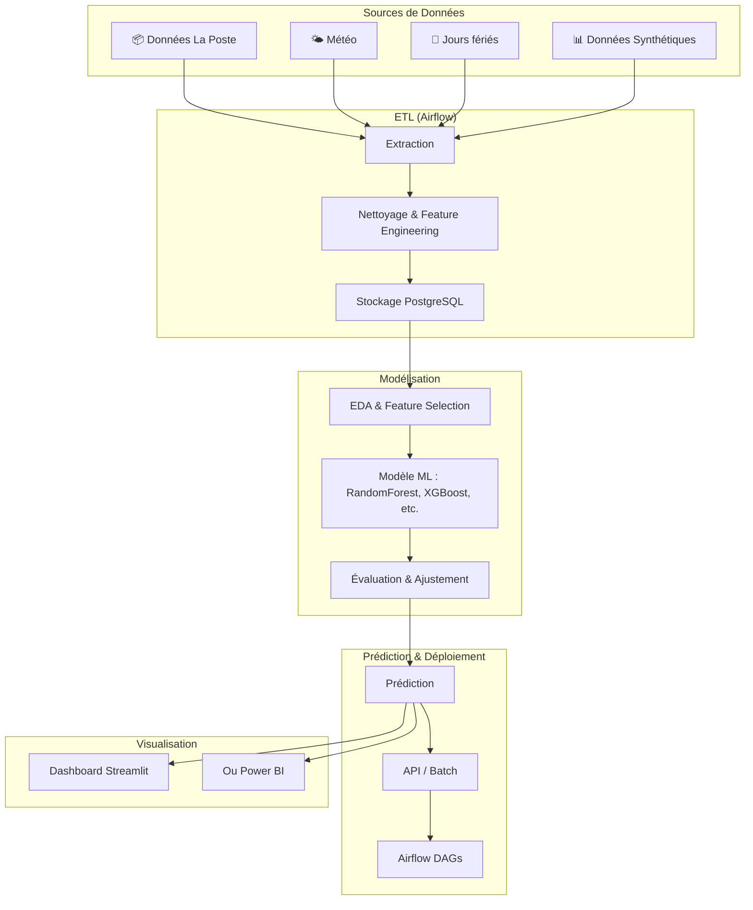

```mermaid
graph TD
    subgraph "Sources de Données"
        A1[📦 Données La Poste]
        A2[🌤️ Météo]
        A3[📅 Jours fériés]
        A4[📊 Données Synthétiques]
    end

    subgraph "ETL (Airflow)"
        B1[Extraction]
        B2[Nettoyage & Feature Engineering]
        B3[Stockage PostgreSQL]
    end

    subgraph "Modélisation"
        C1[EDA & Feature Selection]
        C2[Modèle ML : RandomForest, XGBoost, etc.]
        C3[Évaluation & Ajustement]
    end

    subgraph "Prédiction & Déploiement"
        D1[Prédiction]
        D2[API / Batch]
        D3[Airflow DAGs]
    end

    subgraph "Visualisation"
        E1[Dashboard Streamlit]
        E2[Ou Power BI]
    end

    %% Connexions
    A1 --> B1
    A2 --> B1
    A3 --> B1
    A4 --> B1
    B1 --> B2
    B2 --> B3
    B3 --> C1
    C1 --> C2
    C2 --> C3
    C3 --> D1
    D1 --> E1
    D1 --> E2
    D1 --> D2
    D2 --> D3

```